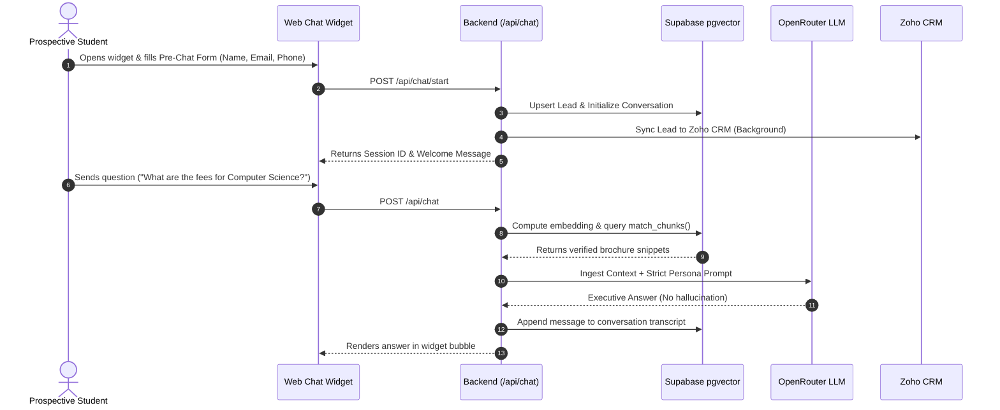
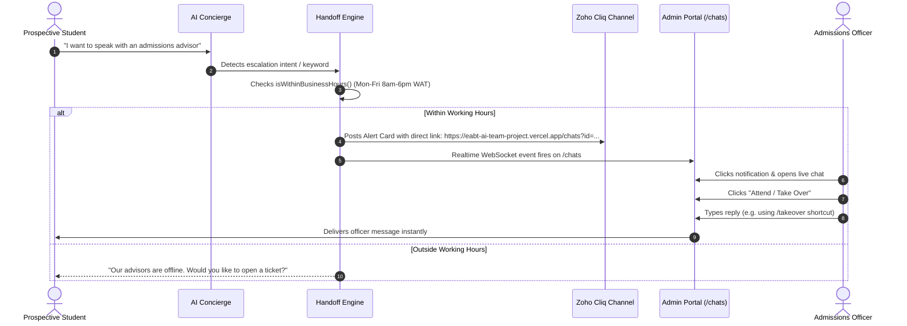
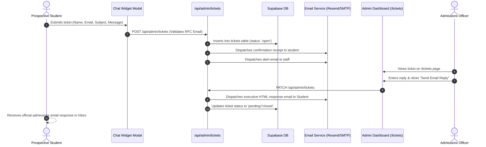

# System Architecture, Data Flows & Technical Integration Guide
## Edutech Babcock & ABU Admissions Intelligence Platform

---

## 🏛️ 1. High-Level System Architecture

The platform provides an omni-channel admissions automation infrastructure connecting prospective students to university admissions staff across **Web Chat**, **WhatsApp Business Cloud API**, **Supabase PostgreSQL & Vector Engine**, **OpenRouter AI LLM**, **Zoho CRM**, **Zoho Cliq**, and **Resend / SMTP Email Services**.

```
                           ┌───────────────────────────────────────────────┐
                           │              PROSPECTIVE STUDENTS             │
                           └───────────────┬───────────────────────────────┘
                                           │
                    ┌──────────────────────┴──────────────────────┐
                    ▼                                             ▼
        ┌───────────────────────┐                     ┌───────────────────────┐
        │  Web Chat Widget      │                     │ WhatsApp Business API │
        │  (Vite + React)       │                     │ (Meta Cloud Webhook)  │
        └───────────┬───────────┘                     └───────────┬───────────┘
                    │                                             │
                    └──────────────────────┬──────────────────────┘
                                           │
                                           ▼
┌─────────────────────────────────────────────────────────────────────────────────────────────┐
│                          VERCEL SERVERLESS BACKEND APIS (Node.js)                           │
│                                                                                             │
│  • /api/chat/start          • /api/chat/index        • /api/whatsapp/webhook                │
│  • /api/admin/tickets       • /api/admin/reply       • /api/admin/escalations               │
│  • /api/documents           • /api/admin/me          • /api/admin/stats                     │
└──────────────┬───────────────────────────┬───────────────────────────┬──────────────────────┘
               │                           │                           │
               ▼                           ▼                           ▼
┌─────────────────────────────┐ ┌─────────────────────┐ ┌─────────────────────────────────────┐
│    SUPABASE DATABASE & RAG  │ │   OPENROUTER AI     │ │      EXTERNAL INTEGRATIONS          │
│                             │ │                     │ │                                     │
│  • PostgreSQL Tables        │ │  • Model: Gemini 2.5│ │  • Zoho CRM (Leads, Contacts, Notes)│
│  • pgvector Embedding Index │ │  • Closed-Domain RAG│ │  • Zoho Cliq (Live Advisor Alerts)  │
│  • Supabase Realtime WS     │ │  • Zero Hallucinate │ │  • Resend API / Nodemailer (Emails) │
│  • Row Level Security (RLS) │ │                     │ │                                     │
└─────────────────────────────┘ └─────────────────────┘ └─────────────────────────────────────┘
```

---

## 🔄 2. End-to-End Interaction Flows

### Flow A: Web Chat Lead Capture & Closed-Domain RAG Answering


---

### Flow B: Live Human Handoff & Business Hours Escalation


---

### Flow C: Offline Support Ticket & Automated Email Reply


---

## 🗄️ 3. Database Schema Overview

| Table | Primary Purpose | Key Columns |
|---|---|---|
| `schools` | Multi-tenant university configuration | `id`, `slug`, `name`, `staff_email`, `branding` |
| `leads` | Student contact profiles & scoring | `id`, `name`, `email`, `phone`, `lead_tier`, `lead_score`, `zoho_contact_id` |
| `conversations`| Full message transcript history | `id`, `session_id`, `lead_id`, `messages` (JSONB), `channel`, `stage` |
| `escalations` | Live human advisor handoff queue | `id`, `conversation_id`, `reason`, `status`, `sla_minutes`, `staff_notes` |
| `tickets` | Offline support inquiries & email replies| `id`, `name`, `email`, `subject`, `message`, `staff_reply`, `status` |
| `admin_profiles`| Staff user accounts & online presence | `id` (auth.users), `email`, `full_name`, `role`, `status`, `last_seen_at` |
| `shortcuts` | Canned responses & quick replies | `id`, `name`, `shortcut` (`/takeover`), `content`, `created_by` |
| `documents` | Knowledge base source PDF documents | `id`, `school_id`, `name`, `storage_path`, `chunk_count` |
| `document_chunks`| Vector embeddings for RAG retrieval | `id`, `content`, `embedding` (VECTOR 1536), `metadata` |

---

## ⚙️ 4. Environment Variables Checklist

Ensure the following variables are configured in **Vercel Project Settings → Environment Variables**:

```env
# ── SUPABASE CREDENTIALS ──
SUPABASE_URL=https://<your-project-ref>.supabase.co
SUPABASE_SERVICE_ROLE_KEY=eyJh...
SUPABASE_ANON_KEY=eyJh...

# ── OPENROUTER AI ──
OPENROUTER_API_KEY=sk-or-v1-...
OPENROUTER_MODEL=google/gemini-2.5-flash

# ── ZOHO CRM INTEGRATION ──
ZOHO_CLIENT_ID=1000....
ZOHO_CLIENT_SECRET=...
ZOHO_REFRESH_TOKEN=1000....
ZOHO_ACCOUNTS_URL=https://accounts.zoho.com
ZOHO_API_DOMAIN=https://www.zohoapis.com

# ── ZOHO CLIQ ALERT WEBHOOKS ──
ZOHO_CLIQ_WEBHOOK_BABCOCK=https://cliq.zoho.com/api/v2/channelsbyname/...
ZOHO_CLIQ_WEBHOOK_ABU=https://cliq.zoho.com/api/v2/channelsbyname/...

# ── EMAIL DISPATCH (RESEND & SMTP FALLBACK) ──
RESEND_API_KEY=re_...
RESEND_FROM_EMAIL=admissions@eabt-ai-team-project.vercel.app
SMTP_HOST=smtp.gmail.com
SMTP_PORT=465
SMTP_USER=eabtconnect@gmail.com
SMTP_PASS=...

# ── WHATSAPP BUSINESS CLOUD API ──
WHATSAPP_TOKEN=EAAB...
WHATSAPP_PHONE_NUMBER_ID=...
WHATSAPP_VERIFY_TOKEN=...
```
